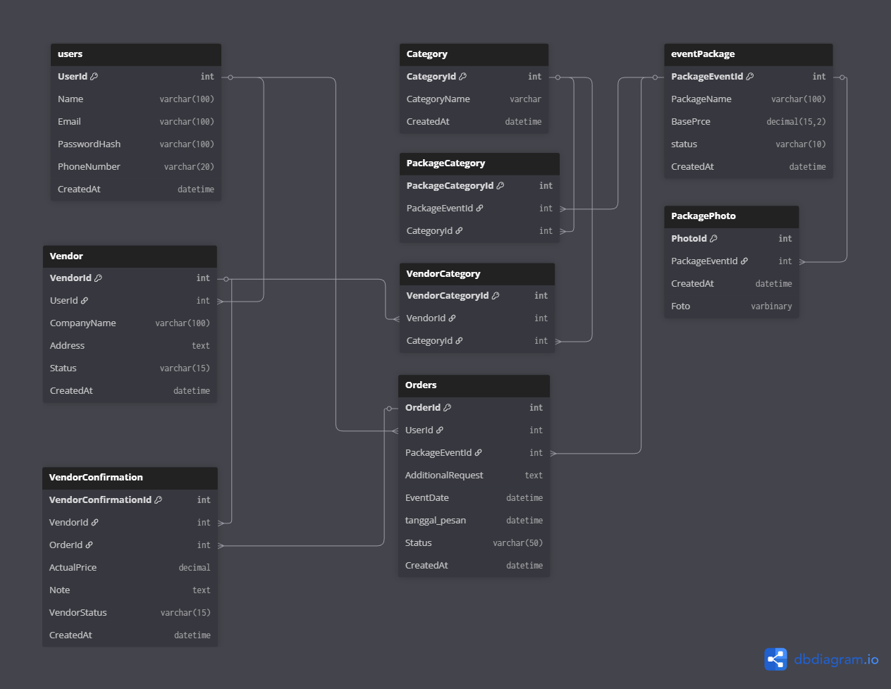

# Dokumentasi Project Event Organizer

## Daftar Isi

1. [Gambaran Umum](#gambaran-umum)
2. [Arsitektur Sistem](#arsitektur-sistem)
3. [Struktur Project](#struktur-project)
4. [Model Data](#model-data)
5. [Alur Kerja Sistem](#alur-kerja-sistem)
6. [Detail Setiap Project](#detail-setiap-project)
7. [Fitur-Fitur Utama](#fitur-fitur-utama)
8. [Teknologi yang Digunakan](#teknologi-yang-digunakan)

---

## Gambaran Umum

**Event Organizer** adalah sistem manajemen event berbasis web yang memungkinkan:

- **Customer** memesan paket event
- **Vendor** menerima dan mengelola request pekerjaan
- **Staff** mengelola pemesanan, paket, dan vendor
- **Admin** mengelola seluruh sistem termasuk user management

Sistem ini dibangun menggunakan **ASP.NET Core MVC** dengan arsitektur **multi-project solution**.

---

## Arsitektur Sistem

```
┌─────────────────────────────────────────────────────────────────┐
│                        DATABASE (SQL Server)                     │
└─────────────────────────────────────────────────────────────────┘
                                  ▲
                                  │
┌─────────────────────────────────────────────────────────────────┐
│                      SHARED MODELS PROJECT                       │
│                   (Models - Class Library)                       │
└─────────────────────────────────────────────────────────────────┘
                                  ▲
          ┌───────────────────────┼───────────────────────┐
          │                       │                       │
┌─────────────────┐     ┌─────────────────┐     ┌─────────────────┐
│  EventOrganizer │     │StaffEventOrganizer│   │AdminEventOrganizer│
│   (Customer &   │     │    (Staff Panel) │   │   (Admin Panel)  │
│  Vendor Portal) │     │                  │   │                  │
└─────────────────┘     └─────────────────┘     └─────────────────┘
     Port: 5000              Port: 5001             Port: 5002
```

---

## Struktur Project

```
EventOrganizer/
├── Models/                          # Shared Models (Class Library)
│   ├── UserModel.cs                 # Model untuk User
│   ├── OrderModel.cs                # Model untuk Order/Pesanan
│   ├── VendorModel.cs               # Model untuk Vendor
│   ├── PackageEventModel.cs         # Model untuk Paket Event
│   ├── CategoryModel.cs             # Model untuk Kategori
│   ├── VendorConfirmationModel.cs   # Model untuk Konfirmasi Vendor
│   ├── DashboardViewModel.cs        # ViewModel untuk Dashboard
│   └── ...
│
├── EventOrganizer/                  # Customer & Vendor Portal
│   ├── Controllers/
│   │   ├── LandingPageController.cs # Halaman utama
│   │   ├── CustomerController.cs    # Fitur customer
│   │   ├── VendorController.cs      # Fitur vendor
│   │   ├── UserController.cs        # Login/Register
│   │   └── ...
│   ├── Views/
│   ├── Repository/
│   └── Interface/
│
├── StaffEventOrganizer/             # Staff Panel
│   ├── Controllers/
│   │   ├── DashboardController.cs   # Dashboard staff
│   │   ├── OrderController.cs       # Manajemen order
│   │   ├── PackageEventController.cs# Manajemen paket
│   │   ├── CategoryController.cs    # Manajemen kategori
│   │   ├── VendorController.cs      # Manajemen vendor
│   │   └── ...
│   ├── Views/
│   ├── Repository/
│   └── Interface/
│
└── AdminEventOrganizer/             # Admin Panel
    ├── Controllers/
    │   ├── DashboardController.cs   # Dashboard admin
    │   ├── UserController.cs        # Manajemen user
    │   ├── OrderController.cs       # Manajemen order
    │   ├── PackageEventController.cs# Manajemen paket
    │   ├── VendorController.cs      # Manajemen vendor
    │   ├── CategoryController.cs    # Manajemen kategori
    │   └── ...
    ├── Views/
    ├── Repository/
    └── Interface/
```

---

## Model Data

### 1. UserModel

Menyimpan data pengguna sistem.

| Field        | Tipe     | Deskripsi                         |
| ------------ | -------- | --------------------------------- |
| UserId       | Guid     | Primary Key                       |
| Name         | string   | Nama pengguna                     |
| Email        | string   | Email (unique)                    |
| PhoneNumber  | string   | Nomor telepon                     |
| PasswordHash | string   | Password terenkripsi              |
| Role         | string   | Customer / Vendor / Staff / Admin |
| IsActive     | bool     | Status aktif akun                 |
| CreatedAt    | DateTime | Tanggal dibuat                    |

### 2. PackageEventModel

Menyimpan data paket event yang ditawarkan.

| Field          | Tipe   | Deskripsi         |
| -------------- | ------ | ----------------- |
| PackageEventId | Guid   | Primary Key       |
| PackageName    | string | Nama paket        |
| Description    | string | Deskripsi paket   |
| BasePrice      | int    | Harga dasar       |
| Status         | string | active / inactive |
| Categories     | List   | Kategori terkait  |
| Photos         | List   | Foto-foto paket   |

### 3. OrderModel

Menyimpan data pemesanan customer.

| Field             | Tipe     | Deskripsi           |
| ----------------- | -------- | ------------------- |
| OrderId           | Guid     | Primary Key         |
| UserId            | Guid     | FK ke User          |
| PackageEventId    | Guid     | FK ke Package       |
| AdditionalRequest | string   | Permintaan tambahan |
| EventDate         | DateTime | Tanggal event       |
| Status            | string   | Status order        |
| ConfirmClient     | int      | Konfirmasi client   |
| CreatedAt         | DateTime | Tanggal order       |

**Status Order:**

- `waiting validation` - Menunggu validasi staff
- `consultation` - Sedang konsultasi
- `vendor confirmation` - Menunggu konfirmasi vendor
- `booking confirmed` - Booking dikonfirmasi
- `cancelled` - Dibatalkan

### 4. VendorModel

Menyimpan data vendor/penyedia jasa.

| Field       | Tipe   | Deskripsi            |
| ----------- | ------ | -------------------- |
| VendorId    | Guid   | Primary Key          |
| UserId      | Guid   | FK ke User           |
| CompanyName | string | Nama perusahaan      |
| Address     | string | Alamat               |
| Status      | string | available / inactive |
| Categories  | List   | Kategori layanan     |

### 5. VendorConfirmationModel

Menyimpan data konfirmasi antara order dan vendor.

| Field                | Tipe     | Deskripsi           |
| -------------------- | -------- | ------------------- |
| VendorConfirmationId | Guid     | Primary Key         |
| OrderId              | Guid     | FK ke Order         |
| VendorId             | Guid     | FK ke Vendor        |
| ActualPrice          | decimal  | Harga aktual vendor |
| Notes                | string   | Catatan             |
| VendorStatus         | string   | Status konfirmasi   |
| CreatedAt            | DateTime | Tanggal dibuat      |

**Status Vendor Confirmation:**

- `pending vendor` - Menunggu respon vendor
- `confirmed` - Diterima oleh vendor
- `vendor confirmed` - Vendor dipilih untuk order
- `closed` - Ditutup/ditolak

### 6. CategoryModel

Menyimpan kategori layanan.

| Field        | Tipe     | Deskripsi      |
| ------------ | -------- | -------------- |
| CategoryId   | Guid     | Primary Key    |
| CategoryName | string   | Nama kategori  |
| CreatedAt    | DateTime | Tanggal dibuat |

---

## Alur Kerja Sistem

### Alur Pemesanan (Customer Journey)

```
┌──────────────┐    ┌──────────────┐    ┌──────────────┐    ┌──────────────┐
│   Customer   │───>│  Lihat Paket │───>│ Pilih Paket  │───>│ Isi Form     │
│    Login     │    │   Event      │    │   & Detail   │    │  Pemesanan   │
└──────────────┘    └──────────────┘    └──────────────┘    └──────────────┘
                                                                    │
                                                                    ▼
┌──────────────┐    ┌──────────────┐    ┌──────────────┐    ┌──────────────┐
│   Event      │<───│  Konfirmasi  │<───│ Staff Kirim  │<───│ Order Masuk  │
│   Selesai    │    │   Client     │    │  ke Vendor   │    │ (Waiting)    │
└──────────────┘    └──────────────┘    └──────────────┘    └──────────────┘
```

### Alur Detail:

1. **Customer Login/Register**

   - Customer mendaftar atau login ke sistem
   - Session disimpan untuk identifikasi user

2. **Melihat & Memilih Paket**

   - Customer melihat daftar paket event aktif
   - Dapat filter berdasarkan kategori
   - Melihat detail paket (foto, deskripsi, harga)

3. **Membuat Pesanan**

   - Pilih tanggal event
   - Isi permintaan tambahan (opsional)
   - Submit order → Status: `waiting validation`

4. **Staff Memproses Order**

   - Staff melihat order masuk
   - Mengubah status menjadi `consultation` atau langsung proses
   - Mengirim request ke vendor yang sesuai kategori

5. **Vendor Merespon**

   - Vendor menerima notifikasi pemesanan
   - Dapat Accept (input harga) atau Reject
   - Jika Accept, vendor lain otomatis di-close

6. **Konfirmasi Final**
   - Staff mengkonfirmasi vendor terpilih
   - Status order: `booking confirmed`
   - Customer dapat melakukan konfirmasi akhir

---

## Detail Setiap Project

### 1. EventOrganizer (Customer & Vendor Portal)

**URL:** `http://localhost:5000`

**Target User:** Customer dan Vendor

#### Controllers:

| Controller              | Fungsi                                                          |
| ----------------------- | --------------------------------------------------------------- |
| `LandingPageController` | Halaman utama website, menampilkan paket event aktif            |
| `UserController`        | Login, Register, Logout untuk semua role                        |
| `CustomerController`    | Dashboard customer, lihat paket, buat order, lihat pesanan      |
| `VendorController`      | Dashboard vendor, kelola profil, lihat & respon pemesanan       |
| `StaffController`       | Akses staff dari portal utama (redirect ke StaffEventOrganizer) |

#### Fitur Customer:

- **Lihat Paket Event** - Browse paket dengan filter kategori
- **Detail Paket** - Lihat foto, deskripsi, harga
- **Buat Pesanan** - Pilih tanggal, isi request tambahan
- **Riwayat Pesanan** - Lihat status semua pesanan
- **Konfirmasi Order** - Konfirmasi final setelah vendor dikonfirmasi

#### Fitur Vendor:

- **Dashboard** - Statistik order, revenue, status
- **Kelola Profil** - Edit info perusahaan, kategori layanan
- **Toggle Status** - Aktif/Tidak aktif menerima order
- **Lihat Pemesanan** - Daftar request yang masuk
- **Accept/Reject** - Terima atau tolak request dengan input harga

---

### 2. StaffEventOrganizer (Staff Panel)

**URL:** `http://localhost:5001`

**Target User:** Staff

#### Controllers:

| Controller               | Fungsi                                               |
| ------------------------ | ---------------------------------------------------- |
| `DashboardController`    | Dashboard dengan statistik order, vendor, paket      |
| `OrderController`        | Kelola semua pesanan, update status, kirim ke vendor |
| `PackageEventController` | CRUD paket event dengan upload foto                  |
| `CategoryController`     | CRUD kategori layanan                                |
| `VendorController`       | Lihat dan update status vendor                       |

#### Fitur:

- **Dashboard**

  - Total order, waiting validation, vendor confirmation, booking confirmed
  - Statistik vendor (total, aktif, pending)
  - Statistik paket (total, aktif, inaktif)

- **Manajemen Order**

  - Lihat semua order dengan pagination & search
  - Update status order
  - Kirim request ke vendor sesuai kategori paket
  - Lihat vendor yang sudah dikirimi request

- **Manajemen Paket Event**

  - Create paket baru dengan multiple foto
  - Edit paket (info & foto)
  - Assign kategori ke paket
  - Hapus paket

- **Manajemen Kategori**

  - CRUD kategori (Catering, Dekorasi, Sound System, dll)

- **Manajemen Vendor**
  - Lihat daftar vendor terdaftar
  - Update status vendor (available/inactive)

---

### 3. AdminEventOrganizer (Admin Panel)

**URL:** `http://localhost:5002`

**Target User:** Admin

#### Controllers:

| Controller               | Fungsi                                        |
| ------------------------ | --------------------------------------------- |
| `DashboardController`    | Dashboard komprehensif dengan semua statistik |
| `UserController`         | Login admin, CRUD semua user, manage role     |
| `OrderController`        | Kelola semua pesanan (sama seperti Staff)     |
| `PackageEventController` | CRUD paket event                              |
| `CategoryController`     | CRUD kategori                                 |
| `VendorController`       | Kelola vendor                                 |

#### Fitur Tambahan (dibanding Staff):

- **User Management**

  - Lihat semua user (Customer, Vendor, Staff, Admin)
  - Create user baru dengan role tertentu
  - Edit user (nama, phone, role, status aktif)
  - Aktifkan/Nonaktifkan akun

- **Dashboard Lengkap**
  - Statistik Order (total, per status)
  - Statistik Vendor (total, aktif, pending confirmation)
  - Statistik Paket (total, aktif, inaktif)
  - Statistik User (total, per role, aktif)
  - Total Revenue

---

## Fitur-Fitur Utama

### 1. Sistem Autentikasi

- Login/Register dengan email dan password
- Session-based authentication
- Role-based access control (Customer, Vendor, Staff, Admin)
- Redirect otomatis berdasarkan role

### 2. Sistem Pemesanan

- Multi-step order process
- Status tracking real-time
- Konfirmasi bertingkat (Staff → Vendor → Customer)

### 3. Sistem Vendor

- Profil vendor dengan kategori layanan
- Request management (Accept/Reject)
- Auto-close vendor lain saat satu vendor di-accept
- Dashboard dengan statistik bisnis

### 4. Manajemen Paket

- Multiple foto upload
- Kategori assignment
- Status aktif/inaktif

### 5. Integrasi WhatsApp

- Link WhatsApp untuk komunikasi langsung
- Format: `https://wa.me/{nomor}`

### 6. Pagination & Search

- Semua list mendukung pagination
- Fitur pencarian berdasarkan nama/status

### 7. Notifikasi Email (MailKit)

- Notifikasi otomatis ke vendor saat ada request baru
- Template email HTML yang responsif
- Informasi detail event via email

---

## Teknologi yang Digunakan

| Komponen     | Teknologi                       |
| ------------ | ------------------------------- |
| Framework    | ASP.NET Core 8.0 MVC            |
| Bahasa       | C#                              |
| Database     | SQL Server                      |
| ORM          | Dapper (Micro ORM)              |
| Frontend     | Bootstrap 5, Razor Views        |
| Session      | ASP.NET Core Session            |
| File Storage | Local Storage (wwwroot/uploads) |
| Email        | MailKit & MimeKit               |

### Pattern yang Digunakan:

- **Repository Pattern** - Memisahkan logic akses data
- **Interface Segregation** - Interface untuk setiap repository
- **Dependency Injection** - Built-in ASP.NET Core DI
- **MVC Pattern** - Model-View-Controller

---

## Cara Menjalankan Project

1. **Prerequisites:**

   - .NET 8.0 SDK
   - SQL Server
   - Visual Studio 2022 / VS Code

2. **Setup Database:**

   - Buat database di SQL Server
   - Update connection string di `appsettings.json` setiap project

3. **Jalankan Project:**

   ```bash
   # Dari root folder solution

   # Jalankan EventOrganizer (Customer/Vendor)
   cd EventOrganizer
   dotnet run

   # Jalankan StaffEventOrganizer
   cd ../StaffEventOrganizer
   dotnet run

   # Jalankan AdminEventOrganizer
   cd ../AdminEventOrganizer
   dotnet run
   ```

4. **Akses Aplikasi:**
   - Customer/Vendor: `http://localhost:5000`
   - Staff Panel: `http://localhost:5001`
   - Admin Panel: `http://localhost:5002`

---

## Diagram Relasi Database



---

## Kontributor

Dibuat untuk memenuhi tugas mata kuliah Analisis Data - Semester 5
Universitas Gunadarma

---

_Dokumentasi ini dibuat untuk memudahkan presentasi dan pemahaman sistem Event Organizer._
